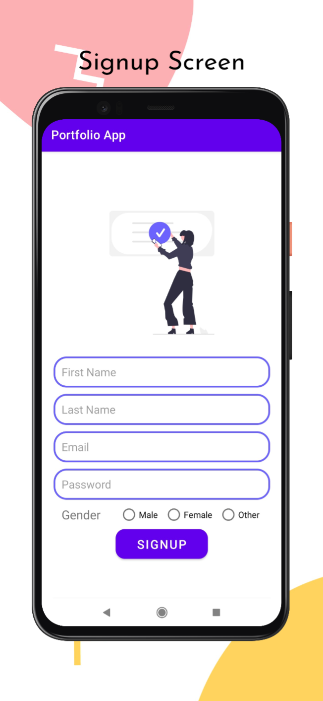
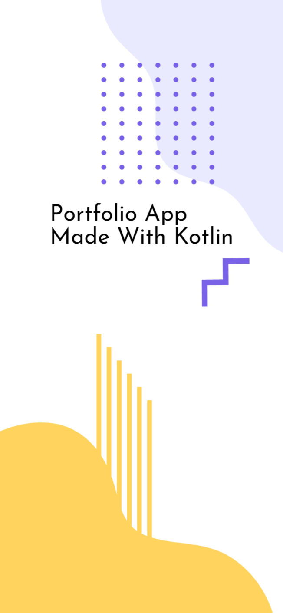

# Portfolio App

- Simple portfolio app made with kotlin.
- RelativeLayout has been used to create a 

## Screenshots

## Description

- RelativeLayout has been used to create the user interface.
- Application has four screen they are following:
    1. Splash Screen
    2. Login Screen
    3. Signup Screen
    4. Profile Screen
